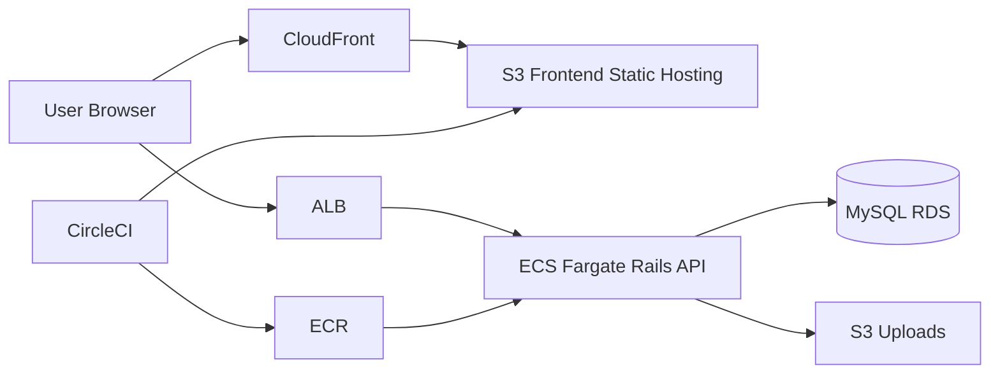
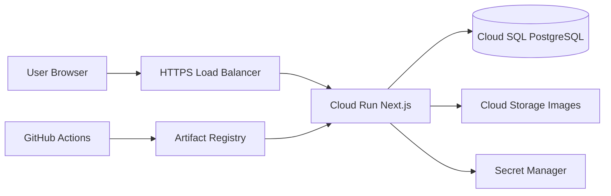
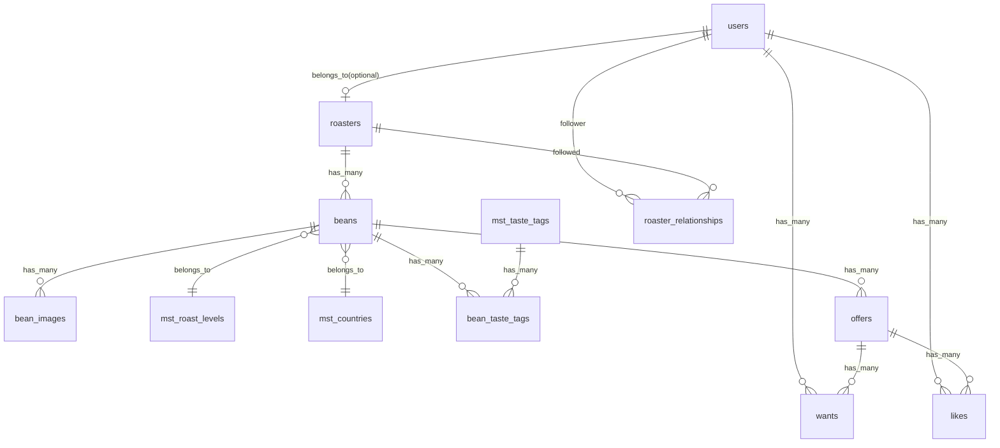
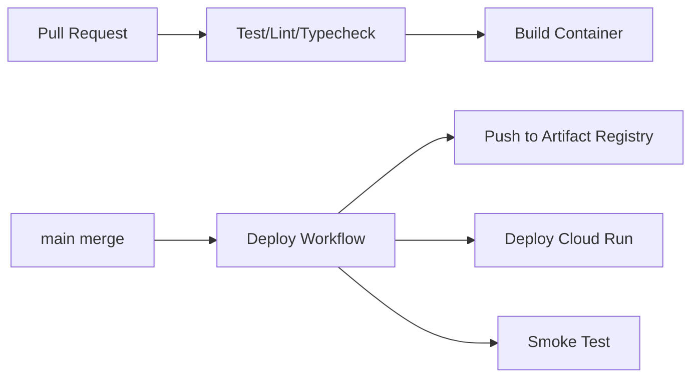

# Bean Stamp Next.js リプレイス実装仕様書（エージェント実装用）

最終更新日: 2026-03-08  
対象旧リポジトリ: `bean_stamp`（React + Rails）  
対象新リポジトリ: 新規作成（Next.js + PostgreSQL + Cloud Run）

## 1. 目的

この仕様書は、**旧リポジトリのソースコードを直接参照せず**、本書と添付リソースのみでエージェントが新リポジトリをゼロから実装できるようにするための実装ガイドである。

要件の要点は次の通り。

- フロントエンドは React SPA から Next.js（App Router）へ移行する
- 旧 `front` ディレクトリは全面リプレイス対象
- 旧 `api` ディレクトリは `api/app/views/api` 配下のAPIレスポンス仕様を中心に移行対象
- 旧Railsのテンプレート返却機能は移行対象外
- インフラは AWS + CircleCI から GCP + GitHub Actions へ移行
- DBは MySQL から PostgreSQL へ移行
- TailwindCSS は継続利用
- 利用ライブラリは移行時点の**最新安定版（latest stable）**を採用し、導入後はlockfileでバージョン固定する
- rails_admin 等の管理機能は移行対象外（存在記録のみ残す）

## 2. スコープ

### 2.1 移行対象（In Scope）

- 認証（メールサインアップ/サインイン/サインアウト/パスワードリセット）
- ユーザー機能
- ロースター機能
- Bean（コーヒー豆）機能
- Offer 機能
- Want 機能
- Like 機能
- RoasterRelationship（フォロー）機能
- 検索機能（ロースター/オファー）
- レコメンド機能
- 通知表示に必要な統計API
- 画像アップロード/表示
- ページネーション
- Tailwind ベースのUI

### 2.2 移行対象外（Out of Scope）

- Railsテンプレート返却側の旧画面
- rails_admin ベースの管理画面機能（存在のみドキュメントに記録）
- 旧AWS固有運用（ECS/ECR/S3/CloudFront/CircleCIの再現）

## 3. 現行アーキテクチャ（As-Is）



補足:

- フロント: Vite + React + TypeScript + Recoil + react-router-dom
- API: Rails 6.1 + devise_token_auth + jbuilder + pagy + ransack
- 画像: CarrierWave + fog-aws
- CI/CD: CircleCI（APIテスト/ビルド/デプロイ + Frontビルド/S3デプロイ）

## 4. 移行後アーキテクチャ（To-Be）



推奨構成:

- Next.js: App Router（`app/`）
- Runtime: Node.js 22 LTS
- ORM: Prisma
- Validation: zod
- Auth: Auth.js（NextAuth）+ DBセッション、または独自JWT（いずれかをIssueで確定）
- Storage: Cloud Storage（署名URL or サーバー経由アップロード）
- Hosting: Cloud Run（単一サービス構成）
- CI/CD: GitHub Actions

## 5. 旧リポジトリから新リポジトリへ持ち込むリソース

新リポジトリで旧ソースを直接参照しないため、以下の資材を**先に旧リポジトリで抽出し、`docs/migration-resources` としてコピー**すること。

### 5.1 必須リソース一覧

- インフラ構成図（現状/移行後）
- DBスキーマ、ER図
- API構成（エンドポイント、認証、レスポンス）
- パイプライン構成（現状/移行後）
- ライブラリ代替表（Ruby -> Node）
- フロントルーティング移行表（React Router -> Next App Router）
- フロントコンポーネント写し（JSX + Tailwind class + 共通CSS）

### 5.2 抽出コマンド（旧リポジトリで実行）

```bash
mkdir -p migration-export/frontend-src
mkdir -p migration-export/api-spec
mkdir -p migration-export/db
mkdir -p migration-export/infra

# 1) フロント写し（HTML/CSS相当: JSX + Tailwind + CSS）
cp -R front/src/components migration-export/frontend-src/
cp -R front/src/features migration-export/frontend-src/
cp -R front/src/router migration-export/frontend-src/
cp front/src/index.css migration-export/frontend-src/index.css
cp front/tailwind.config.cjs migration-export/frontend-src/
cp front/postcss.config.cjs migration-export/frontend-src/

# 2) API仕様写し
cp -R api/app/views/api migration-export/api-spec/views-api
cp -R api/app/controllers/api/v1 migration-export/api-spec/controllers-v1
cp api/config/routes.rb migration-export/api-spec/routes.rb
cp api/app/controllers/api/application_controller.rb migration-export/api-spec/api_application_controller.rb

# 3) DB
cp api/db/schema.rb migration-export/db/schema.rb
cp -R api/db/fixtures migration-export/db/fixtures

# 4) CI/CD / インフラ関連
cp .circleci/config.yml migration-export/infra/circleci_config.yml
cp docker-compose.yml migration-export/infra/docker-compose.yml
cp README.md migration-export/infra/readme_architecture.md
```

備考: 本プロジェクトでは「フロントのHTML/CSS写し」は、`tsx`内JSXとTailwind class、`index.css`を一次ソースとして扱う。

### 5.3 新リポジトリへの移送手順（抜け防止の標準手順）

`migration-export` を作成しただけでは不十分なので、以下を必ず実行する。

#### 手順A: 旧リポジトリ側でアーカイブ化（単一PCコピー前提）

```bash
# 旧リポジトリ直下で実行
tar -czf migration-export.tar.gz migration-export
```

生成物:

- `migration-export.tar.gz`

#### 手順B: 新リポジトリへ受け渡し

ローカル同一端末で作業する場合:

```bash
# 新リポジトリ直下で実行
mkdir -p docs
cp /path/to/old-repo/migration-export.tar.gz ./docs/
```

リモートで受け渡す場合（例: scp）:

```bash
scp migration-export.tar.gz <new-repo-host>:/path/to/new-repo/docs/
```

#### 手順C: 新リポジトリで展開・検証

```bash
# 新リポジトリ直下で実行
cd docs
tar -xzf migration-export.tar.gz
mv migration-export migration-resources
cd ..
```

期待配置:

- `docs/migration-resources/frontend-src`
- `docs/migration-resources/api-spec`
- `docs/migration-resources/db`
- `docs/migration-resources/infra`

#### 手順D: 新リポジトリで初回コミット

```bash
git add docs/migration-resources
git commit -m "chore: import migration resources from legacy repo"
```

注意:

- `migration-export.tar.gz` 本体は容量が大きい場合があるため、通常はコミットしない（必要ならRelease Artifactで管理）
- 以降の実装Issueでは **旧リポジトリ参照禁止** とし、`docs/migration-resources` のみ参照する

## 6. ドメインモデル / DB（MySQL -> PostgreSQL）

主要テーブル（旧 `api/db/schema.rb` ベース）:

- `users`
- `roasters`
- `beans`
- `bean_images`
- `mst_roast_levels`
- `mst_countries`
- `mst_taste_tags`
- `bean_taste_tags`
- `offers`
- `wants`
- `likes`
- `roaster_relationships`

### 6.1 ER 図（移行後も同等維持）



### 6.2 PostgreSQL移行ポリシー

- PKは `bigint`（またはPrisma標準 `BigInt`）を維持
- enum相当（Offer.status, Want.rate）はPostgreSQL enumで定義
- 既存ユニーク制約を維持
- 既存外部キー制約を維持
- テーブル/カラム命名は snake_case を維持
- APIレスポンスは camelCase（現行フロント互換）

## 7. API仕様（移行対象）

基準:

- 旧 `api/config/routes.rb` の `namespace :api do ... namespace :v1` 配下
- 旧 `api/app/views/api/v1/**/*.jbuilder` のレスポンス形状
- 旧フロント `front/src/features/**/api/*.ts` の呼び出し実績

### 7.1 認証/ヘッダ仕様

- 旧仕様は `uid`, `client`, `access-token` をcookie保持してAPIヘッダ送信
- 新仕様は以下のどちらかを採用
- A: Auth.jsセッションCookie（推奨、BFFで外部露出ヘッダを減らす）
- B: 旧互換ヘッダ運用を維持（移行コスト低、保守複雑）

### 7.2 ページネーション仕様

現行は `Current-Page`, `Total-Pages` 等をレスポンスヘッダで返却。新環境では次のどちらか。

- 推奨: JSON body に `meta: { currentPage, totalPages, totalCount, pageItems }`
- 互換: ヘッダ返却を維持

### 7.3 エンドポイント一覧（優先実装対象）

#### Auth

- `POST /api/v1/auth` サインアップ
- `POST /api/v1/auth/sign_in` サインイン
- `GET /api/v1/auth/sign_out` サインアウト
- `PATCH /api/v1/auth` ユーザー更新
- `DELETE /api/v1/auth` ユーザー削除
- `GET /api/v1/auth/sessions` ログイン状態取得
- `POST /api/v1/auth/password` リセットメール送信
- `PUT /api/v1/auth/password` パスワード更新

#### Users / Roasters / Relations

- `GET /api/v1/users/:id`
- `GET /api/v1/users/current_offers`
- `GET /api/v1/users/:id/roasters_followed_by_user`
- `GET /api/v1/roasters/:id`
- `POST /api/v1/roasters`
- `PUT /api/v1/roasters/:id`
- `DELETE /api/v1/roasters/:id`
- `GET /api/v1/roasters/:id/followers`
- `GET /api/v1/roasters/:id/offers`
- `GET /api/v1/roaster_relationships?roaster_id=:id`
- `POST /api/v1/roaster_relationships`
- `DELETE /api/v1/roaster_relationships/:id`

#### Beans

- `GET /api/v1/beans`
- `GET /api/v1/beans/:id`
- `POST /api/v1/beans`
- `PUT /api/v1/beans/:id`
- `DELETE /api/v1/beans/:id`

#### Offers

- `GET /api/v1/offers`
- `GET /api/v1/offers/:id`
- `POST /api/v1/offers`
- `PUT /api/v1/offers/:id`
- `DELETE /api/v1/offers/:id`
- `GET /api/v1/offers/recommend`
- `GET /api/v1/offers/stats`
- `GET /api/v1/offers/:id/wanted_users`

#### Wants / Likes

- `GET /api/v1/wants`
- `GET /api/v1/wants/:id`
- `POST /api/v1/wants`
- `DELETE /api/v1/wants/:id`
- `PATCH /api/v1/wants/:id/receipt`
- `PATCH /api/v1/wants/:id/rate`
- `GET /api/v1/wants/stats`
- `GET /api/v1/likes`
- `POST /api/v1/likes`
- `DELETE /api/v1/likes/:id`

#### Search

- `GET /api/v1/search/roasters`
- `GET /api/v1/search/offers`

## 8. フロント移行仕様（React Router -> Next App Router）

### 8.1 現行ルート

- `/`
- `/about`
- `/help`
- `/auth/*`
- `/users/*`
- `/roasters/*`
- `/beans/*`
- `/offers/*`
- `/wants/*`
- `/likes/*`
- `/search/*`

### 8.2 Next.js ルート設計（案）

- `app/(public)/page.tsx` -> `/`
- `app/(public)/about/page.tsx` -> `/about`
- `app/(public)/help/page.tsx` -> `/help`
- `app/(auth)/auth/signin/page.tsx`
- `app/(auth)/auth/signup/page.tsx`
- `app/(auth)/auth/password_reset/page.tsx`
- `app/(app)/users/home/page.tsx`
- `app/(app)/users/[id]/page.tsx`
- `app/(app)/users/[id]/following/page.tsx`
- `app/(app)/users/edit/page.tsx`
- `app/(app)/users/password/page.tsx`
- `app/(app)/users/cancel/page.tsx`
- `app/(app)/roasters/home/page.tsx`
- `app/(app)/roasters/new/page.tsx`
- `app/(app)/roasters/edit/page.tsx`
- `app/(app)/roasters/cancel/page.tsx`
- `app/(app)/roasters/[id]/page.tsx`
- `app/(app)/roasters/[id]/follower/page.tsx`
- `app/(app)/beans/page.tsx`
- `app/(app)/beans/new/page.tsx`
- `app/(app)/beans/[id]/page.tsx`
- `app/(app)/beans/[id]/edit/page.tsx`
- `app/(app)/offers/page.tsx`
- `app/(app)/offers/[id]/page.tsx`
- `app/(app)/offers/[id]/wanted_users/page.tsx`
- `app/(app)/wants/page.tsx`
- `app/(app)/wants/[id]/page.tsx`
- `app/(app)/likes/page.tsx`
- `app/(app)/search/page.tsx`
- `app/(app)/search/roasters/page.tsx`
- `app/(app)/search/offers/page.tsx`

### 8.3 ガード仕様

現行の `ProtectedRoute`, `RequireSignedOutRoute`, `RequireForBelongingToRoaster`, `RequireNotIsRoaster` を以下へ置換。

- middleware + server-side session check
- レイアウト単位での権限ガード
- `redirect()` を用いたSSR時リダイレクト

## 9. ライブラリ置換表（Ruby/Rails -> Node/Next）

前提ポリシー:

- 置換先ライブラリは「移行着手時点の最新安定版」を採用する
- メジャーアップデート追従はIssue化して段階適用する
- 再現性確保のため `package-lock.json` / `pnpm-lock.yaml` / `yarn.lock` を必ずコミットする

| 現行 | 用途 | 移行候補 |
|---|---|---|
| devise + devise_token_auth | 認証 | Auth.js + Prisma Adapter |
| ActiveRecord | ORM | Prisma |
| jbuilder | JSON整形 | TypeScript DTO Mapper + zod |
| pagy | ページネーション | Prisma skip/take + 共通pagination util |
| ransack | 検索 | Prisma where builder |
| carrierwave + fog-aws | 画像アップロード | `@google-cloud/storage` |
| seed-fu | シード投入 | Prisma seed script |
| rspec | テスト | Vitest + Playwright |
| rubocop | Lint | ESLint + Biome or Prettier |
| rails_admin/cancancan | 管理画面/権限制御 | 今回移行対象外（記録のみ） |

## 10. パイプライン移行（CircleCI -> GitHub Actions）

### 10.1 現行（要約）

- API: build, rubocop, rspec
- Front: build
- mainブランチでECR push + ECS deploy
- Front成果物をS3へsync

### 10.2 移行後（案）



推奨ワークフロー:

- `.github/workflows/ci.yml`
- `.github/workflows/cd.yml`
- `.github/workflows/db-migrate.yml`

## 11. Issue分割実装計画（1 Issue = 1 関心領域）

以下の順で進める。各Issueは完了条件（DoD）を満たしたら次へ進む。

### Issue 00: 新リポジトリ初期化

目的:

- Next.js + TypeScript + Tailwind の最小起動

作業:

- `create-next-app`（App Router）
- Lint/Format/Typecheck 設定
- Node 22, pnpm or yarn 固定

DoD:

- ローカルで `pnpm dev` が起動
- CIで lint/typecheck が通る

### Issue 01: 移行資材の取り込み

目的:

- 旧コードを直接見ずに実装できる土台を作る

作業:

- `docs/migration-resources` に抽出済み資材を配置
- API/DB/フロント写しの目次を作成

DoD:

- 必須リソース一覧の欠落ゼロ

### Issue 02: アーキテクチャ骨組み

目的:

- Next.js内に BFF/API 層と UI 層を分離

作業:

- `app/` ルート構成の作成
- `src/server`（DB/Auth/API）層作成
- 環境変数管理（zod）

DoD:

- フォルダ構成が確定し、READMEに記載

### Issue 03: DB実装（PostgreSQL + Prisma）

目的:

- 旧ERをPostgreSQLで再現

作業:

- Prisma schema 作成
- migration 実行
- seed（country, roastLevel, tasteTag）作成

DoD:

- 全テーブル生成
- 主要制約（FK/unique/enum）を再現

### Issue 04: 認証基盤実装

目的:

- サインアップ/サインイン/サインアウト/セッション取得

作業:

- Auth.js 実装
- パスワードリセット実装
- ルートガード実装

DoD:

- 認証系E2Eが通る

### Issue 05: 共通UI基盤移植

目的:

- ヘッダ、ナビ、レイアウト、トースト、アイコンを移植

作業:

- `front/src/components/Layout` を起点に移植
- `index.css` とTailwind設定を反映

DoD:

- 共通レイアウトで既存同等表示

### Issue 06: Users / Roasters / Follow機能

目的:

- ユーザープロフィール、ロースター、フォローを実装

作業:

- API route handler + server actions
- 一覧/詳細/編集/削除

DoD:

- 主要画面とAPIがE2Eで通る

### Issue 07: Beans機能

目的:

- Bean CRUD と画像アップロード、味覚タグを実装

作業:

- multipart upload
- バリデーション（画像枚数・タグ数）

DoD:

- Bean作成/編集/削除が通る

### Issue 08: Offers機能

目的:

- Offer CRUD、ステータス計算、wanted_users を実装

作業:

- 日付バリデーション
- ステータス集計API

DoD:

- Offer画面/統計表示が再現

### Issue 09: Wants / Likes機能

目的:

- Want/Like、受取、評価、統計を実装

作業:

- rate/receipt 更新
- wants stats / likes list

DoD:

- Want/Like連携動作が再現

### Issue 10: Search / Recommend機能

目的:

- 検索（roasters/offers）とレコメンドを実装

作業:

- Prisma where builder
- 風味グループ集計ロジック

DoD:

- 検索結果・レコメンドが表示される

### Issue 11: ページネーション/通知/状態管理

目的:

- ページングと通知バッジ動作を再現

作業:

- pagination meta仕様確定
- クライアント状態管理（zustand または React Query）

DoD:

- 全一覧画面でページング可能

### Issue 12: テスト整備

目的:

- 回帰防止

作業:

- 単体テスト
- API統合テスト
- E2E（主要導線）

DoD:

- CIで安定して通る

### Issue 13: Cloud Runデプロイ

目的:

- GCP本番相当デプロイ

作業:

- Dockerfile最適化
- Cloud Run/Cloud SQL/Secret Manager接続
- GCS設定

DoD:

- ステージングURLで動作確認

### Issue 14: GitHub Actions CI/CD

目的:

- 自動テスト・自動デプロイ確立

作業:

- `ci.yml`, `cd.yml`, `db-migrate.yml`
- OIDCでGCP認証

DoD:

- mainマージで自動デプロイ成功

### Issue 15: 受け入れ・切替

目的:

- 本番切替判定

作業:

- 受け入れテスト
- パフォーマンス/監視確認
- ロールバック手順確認

DoD:

- 切替チェックリスト完了

## 12. 新リポジトリでの実装実行手順（エージェント向け）

1. `docs/migration-resources` の内容をインデックス化する
2. Issue 00 から順に1件ずつ実施する
3. 各Issueで「実装 -> テスト -> ドキュメント更新 -> PR作成」を完了する
4. 次Issue開始前にDoDチェックを行う

### 12.1 各Issueで必ず実施するテンプレート

- 目的確認
- 受入条件確認
- 実装
- 影響範囲テスト
- 差分サマリ作成
- 未決事項を `docs/decisions/*.md` に記録

## 13. 非機能要件

- パフォーマンス: 初回表示体感を現行同等以上
- 可用性: Cloud Run複数インスタンス運用
- セキュリティ: Secret Manager利用、機密情報をrepoに保存しない
- 保守性: API入出力をzodスキーマで定義
- 観測性: 構造化ログ、エラー通知、ヘルスチェック

## 14. 既知事項・注意点

- 旧実装には Rails由来の歴史的資産があるため、`api/app/views/api` 以外は原則移行対象外
- `rails_admin` 等の枝葉機能は除外
- 旧Frontは `axios-case-converter` で snake/camel 変換しているため、新実装はDTO層で吸収する
- 旧Pagyはヘッダでページ情報を返しているため、互換方針をIssue 11で決定する
- 旧CORSは `uid/client/access-token` や pagination header expose 前提

## 15. 完了判定

- 主要機能が旧アプリ同等で動作
- UIが旧デザインと大きく乖離しない
- CI/CDがGitHub Actions + Cloud Runで稼働
- PostgreSQL運用で本番相当データを扱える
- 旧repoを参照せず、本仕様書＋移行資材のみで継続開発可能
