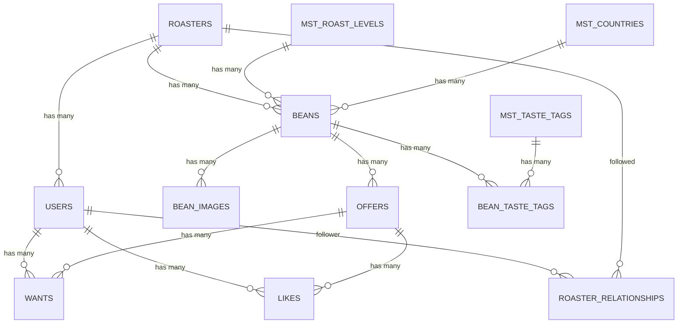

# Prisma リレーション一覧

`prisma/schema.prisma` を元に、このプロジェクトのリレーションを整理したメモ。

## 見方

- 1:1
  - どちらか片方が外部キーを持ち、その外部キーに `@unique` が付く
- 1:N
  - 「多」側が外部キーを持つ
  - 「一」側は `Model[]` で逆参照する
- N:N
  - 中間テーブルを 2 本の 1:N として表現する
  - Prisma では暗黙的 N:N も書けるが、このプロジェクトは旧 DB 互換のため中間テーブルを明示している

## 1:1

現状の schema には 1:1 リレーションはない。

## 1:N

### `Roaster` 1:N `User`

- 外部キー: `users.roaster_id`
- Prisma 上の対応
  - `User.roasterId`
  - `User.roaster`
  - `Roaster.users`

### `Roaster` 1:N `Bean`

- 外部キー: `beans.roaster_id`
- Prisma 上の対応
  - `Bean.roasterId`
  - `Bean.roaster`
  - `Roaster.beans`

### `RoastLevel` 1:N `Bean`

- 外部キー: `beans.roast_level_id`
- Prisma 上の対応
  - `Bean.roastLevelId`
  - `Bean.roastLevel`
  - `RoastLevel.beans`

### `Country` 1:N `Bean`

- 外部キー: `beans.country_id`
- Prisma 上の対応
  - `Bean.countryId`
  - `Bean.country`
  - `Country.beans`

### `Bean` 1:N `BeanImage`

- 外部キー: `bean_images.bean_id`
- Prisma 上の対応
  - `BeanImage.beanId`
  - `BeanImage.bean`
  - `Bean.beanImages`

### `Bean` 1:N `Offer`

- 外部キー: `offers.bean_id`
- Prisma 上の対応
  - `Offer.beanId`
  - `Offer.bean`
  - `Bean.offers`

### `User` 1:N `Want`

- 外部キー: `wants.user_id`
- Prisma 上の対応
  - `Want.userId`
  - `Want.user`
  - `User.wants`

### `Offer` 1:N `Want`

- 外部キー: `wants.offer_id`
- Prisma 上の対応
  - `Want.offerId`
  - `Want.offer`
  - `Offer.wants`

### `User` 1:N `Like`

- 外部キー: `likes.user_id`
- Prisma 上の対応
  - `Like.userId`
  - `Like.user`
  - `User.likes`

### `Offer` 1:N `Like`

- 外部キー: `likes.offer_id`
- Prisma 上の対応
  - `Like.offerId`
  - `Like.offer`
  - `Offer.likes`

### `User` 1:N `RoasterRelationship`

- 外部キー: `roaster_relationships.follower_id`
- Prisma 上の対応
  - `RoasterRelationship.followerId`
  - `RoasterRelationship.follower`
  - `User.followingRelationships`
- 補足
  - `User` と `RoasterRelationship` の関連は意味が分かるように `@relation("FollowerRelationships")` で命名している

### `Roaster` 1:N `RoasterRelationship`

- 外部キー: `roaster_relationships.roaster_id`
- Prisma 上の対応
  - `RoasterRelationship.roasterId`
  - `RoasterRelationship.roaster`
  - `Roaster.followers`
- 補足
  - `Roaster` と `RoasterRelationship` の関連は `@relation("RoasterFollowers")` で命名している

### `Bean` 1:N `BeanTasteTag`

- 外部キー: `bean_taste_tags.bean_id`
- Prisma 上の対応
  - `BeanTasteTag.beanId`
  - `BeanTasteTag.bean`
  - `Bean.beanTasteTags`

### `TasteTag` 1:N `BeanTasteTag`

- 外部キー: `bean_taste_tags.mst_taste_tag_id`
- Prisma 上の対応
  - `BeanTasteTag.tasteTagId`
  - `BeanTasteTag.tasteTag`
  - `TasteTag.beanTasteTags`

## N:N

### `Bean` N:N `TasteTag`

- 中間テーブル: `bean_taste_tags`
- Prisma 上では次の 2 本の 1:N で構成される
  - `Bean` 1:N `BeanTasteTag`
  - `TasteTag` 1:N `BeanTasteTag`
- 一意制約
  - `@@unique([beanId, tasteTagId])`

### `User` N:N `Roaster`

- 中間テーブル: `roaster_relationships`
- Prisma 上では次の 2 本の 1:N で構成される
  - `User` 1:N `RoasterRelationship`
  - `Roaster` 1:N `RoasterRelationship`
- 一意制約
  - `@@unique([followerId, roasterId])`

### `User` N:N `Offer` via `Want`

- 中間テーブル: `wants`
- Prisma 上では次の 2 本の 1:N で構成される
  - `User` 1:N `Want`
  - `Offer` 1:N `Want`
- 一意制約
  - `@@unique([userId, offerId])`

### `User` N:N `Offer` via `Like`

- 中間テーブル: `likes`
- Prisma 上では次の 2 本の 1:N で構成される
  - `User` 1:N `Like`
  - `Offer` 1:N `Like`
- 一意制約
  - `@@unique([userId, offerId])`

## ER 図

## 補足

- `Roaster.users` や `Bean.offers` のような `Model[]` は、DB に配列カラムを作る意味ではない
- DB の実体は外部キーを持つ「多」側にある
- `@relation("...")` は、関連名を明示して Prisma にどの関連同士が対になるかを教えるために使う
- この schema では特に `RoasterRelationship` のような中間テーブルで、意味を明確にするため relation 名を付けている
